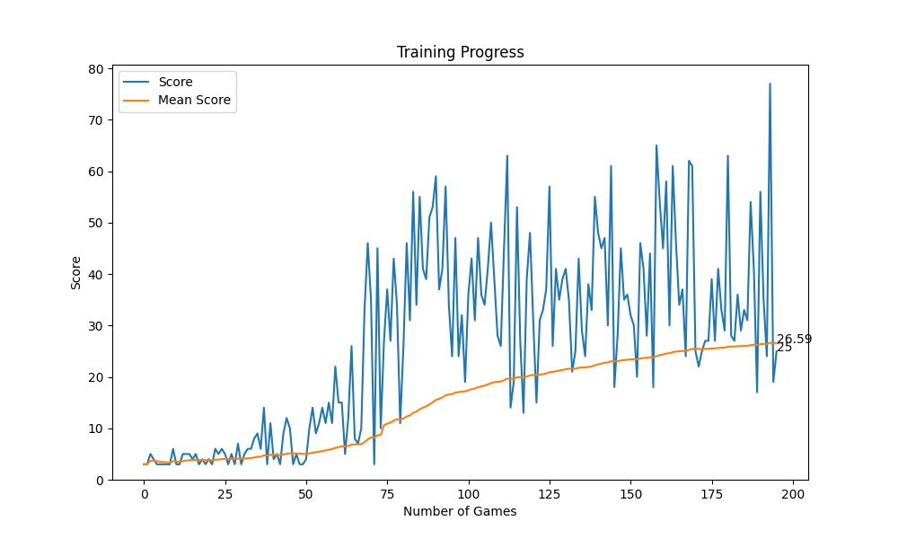

# 🐍 AI Serpentis

This project implements a Snake Game with both manual and AI gameplay modes. The AI learns to play the game using **Deep Q-Learning**, training over multiple iterations to improve its performance. Built with **Pygame** for visuals and **PyTorch** for the AI model.

> **Note**: This project is a fork of [`armin2080/Snake-Game-AI`](https://github.com/armin2080/Snake-Game-AI) with significant enhancements and extensions.

---
# Demo Video 🎥

[](  https://raw.githubusercontent.com/plushycat/AI-Serpentis/main/assets/demo_video/demo_serpentis.mp4)


---

## ✨ Features

### 🎮 Game Features
- **Classic Mode**: Play the snake game manually with keyboard controls  
- **AI Mode**: Watch a trained neural network play the game  
- **Modern UI**: Sleek gradient backgrounds, custom animations, and particle effects  
- **Customization Options**: Choose from various snake and food themes  
- **Responsive Controls**: WASD/Arrow keys for movement and pause functionality  

### 🧠 AI Implementation
- **Deep Q-Learning**: Neural network with 11-dimensional state and 3 outputs  
- **Training System**: Train the AI from scratch or continue from checkpoints  
- **Performance Visualization**: Real-time plots of scores and training progress  
- **Save/Load System**: Maintains high scores and AI training progress  

---

## 📁 Project Structure

```
AI-Serpentis/
├── src/                    # Source code
│   ├── ai/                 # AI implementation
│   │   ├── agent.py        # Reinforcement learning agent
│   │   ├── model.py        # Neural network architecture
│   │   └── watch_ai.py     # AI visualization script
│   ├── game/               # Game implementation
│   │   ├── snake_game.py   # Classic snake game
│   │   ├── snake_ai.py     # AI-compatible game environment
│   │   └── customization.py # Theme management
│   ├── ui/                 # User interface
│   │   └── main.py         # UI implementation and menu system
│   └── utils/              # Utility functions
│       ├── plotter.py      # Training progress visualization
│       └── __init__.py     # Common utilities
├── assets/                 # Game assets (fonts, sounds, images)
├── data/                   # Data storage
│   ├── models/             # Trained AI models
│   ├── plots/              # Plots showing NN training over time
│   ├── checkpoints/        # Training checkpoints
│   └── stats/              # Game statistics
├── utils/                  # Global utilities
└── main.py                 # Main entry point
```

---

## 💠 Prerequisites

Make sure you have the following installed:

- Python 3.10+
- Pygame
- PyTorch
- Matplotlib

Install dependencies with:

```bash
pip install -r requirements.txt
```

---

## 🎯 Game Logic

### 🐍 Classic Snake Game
- Control the snake to eat food and grow longer  
- Avoid colliding with yourself  
- The snake wraps around the screen edges  
- Score increases as you collect more food  

### 🧠 AI Logic
- **State Representation**: 11-dimensional vector including:
  - Danger detection (left, front, right, bottom)
  - Current movement direction
  - Food location relative to snake head
- **Action Selection**: One of `[Straight, Right Turn, Left Turn]`
- **Reward System**:
  - `+10` for eating food  
  - `-10` for collisions  
  - Small positive reward for moving toward food
- **Neural Network**:  
  `11 → 256 → 3` feedforward network with ReLU activations  

---

## 🎨 Customization Options

- **Snake Themes**:  
  Classic Green, Cool Blue, Fire, Royal Purple, Sky Blue, or Random  
- **Food Themes**:  
  Red Apple, Blueberry, Rainbow (dynamic), or Golden  
- **Background Themes**:  
  Light or Dark mode  
- **Debug Mode**:  
  Enables real-time AI debug information overlay  

---
## 🚀 Running the Project

### Main Game
To start the game with both manual and AI modes:

```bash
python main.py
```

This launches the game interface where you can select your preferred mode and customization options.

### Training Mode
To train the AI from scratch or continue training:

```bash
python src/ai/agent.py
```

Training options:
- Training will save checkpoints to `data/checkpoints/` automatically
- Press `Esc` during training to save and exit
- Training visualization will be saved to `data/plots/`

You can adjust training parameters by modifying the constants in `agent.py`:
- `MAX_MEMORY`: Memory buffer size
- `BATCH_SIZE`: Sample size for learning
- `LR`: Learning rate
- `GAMMA`: Discount factor

---

## 📈 Results

After sufficient training (minimum of 200 cycles), the AI consistently achieves high scores by developing strategies to efficiently collect food while avoiding collisions.

Here is a sample graph after training for 200 Iterations:



---

## 🎵 Credits

- **BGM**: *Music by Nicholas Panek* from [Pixabay](https://pixabay.com)  
- **Level Up Sound**: *Magic Game Key Picked Up* by Epic Stock Media from [Upbeat](https://www.upbeat.io)  
- **UI Click Sound**: *Arcade Game Bling* by Epic Stock Media from [Upbeat](https://www.upbeat.io)  
- **Mute and Unmute Buttons:**  [Freepik](https://freepik.com)  

- **Source Repository:** [armin2080/Snake-Game-AI](https://github.com/armin2080/Snake-Game-AI)

