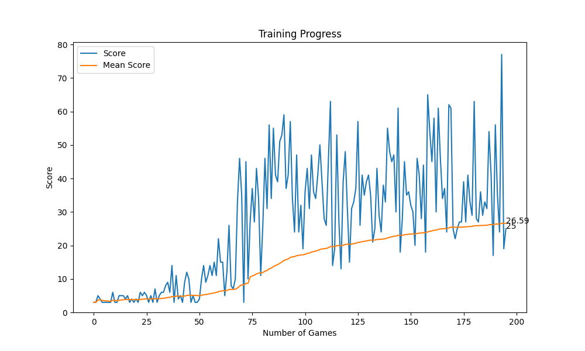
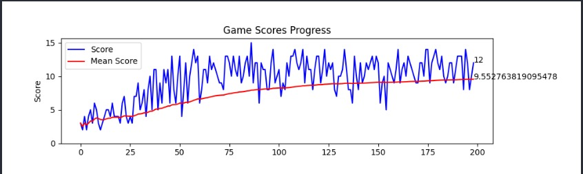

# AI Serpentis

This project implements a modern Snake Game featuring manual play, AI-controlled play with Deep Q-Learning, Player vs AI split-screen mode, and Fibonacci Snake Mode—all wrapped in a sleek, customizable Pygame GUI.

> Forked from [armin2080/Snake-Game-AI](https://github.com/armin2080/Snake-Game-AI) with significant enhancements.

## 🎮 Demo Video

https://github.com/user-attachments/assets/1b68bf50-60f1-4c06-9df4-b9c3b067056d
---

## ✨ Features

- **Classic Mode**: Manual control via Arrow Keys / WASD.
- **Fibonacci Mode**: Each food increases length by the next 
Fibonacci number.
- **AI Mode**: Autonomous play using a Deep Q-Learning agent, implemented for both Classic and Fibonacci Modes.
- **Player vs AI**: Split-screen, real-time competition.

### 🎨 UI & Customization

- **Dynamic Themes**: Pastel gradients, particle effects, smooth transitions.
- **Config Pages**: Built as `src/ui/pages`—Home, Info, Scores, Settings & Help.
- **Persistent Settings**:
  - Appearance & Audio: `statics/game_settings.json`
  - Snake & Food Themes: `statics/customization.json`

### 🧠 AI Implementation

- **Neural Network**: Feedforward DQN (`11 → 256 → 3`) with ReLU.
- **Transfer Learning (Fibonacci AI Mode)**: A DQN agent trained via transfer learning. based on the above Neural Network.
- **State Representation**: Danger sensors (front, left, right), current direction, relative food position.
- **Actions**: `[Straight, Right Turn, Left Turn]`
- **Reward Scheme**:
  - `+10` for eating food
  - `-10` for collisions
  - Small positive reward for approaching food
- **Training Tools**:
  - `agent.py`: Train base model
  - `transfer_fibonacci_ai.py`: Transfer learning for Fibonacci Mode
  - `watch_ai.py` / `watch_fibonacci_ai.py`: Visualize AI gameplay

---

## 📁 Project Structure

```
AI-Serpentis/
├── assets/                  # Fonts, images, and sounds used in the game
├── data/
│   ├── checkpoints/         # Saved training checkpoints for Classic AI
│   ├── models/              # Final and transfer-learned AI models
│   ├── plots/               # Generated plots for training performance
│   └── stats/               # Game scores and performance logs
├── statics/                 # Persistent user settings and theme preferences
├── src/
│   ├── ai/                           # All AI-related scripts
│   │   ├── agent.py                  # DQN training loop
│   │   ├── model.py                  # Classic Neural network model
│   │   ├── transfer_fibonacci_ai.py  # Transfer learning script
│   │   ├── watch_ai.py               # Watch trained Classic AI
│   │   ├── watch_fibonacci_ai.py     # Watch trained Fibonacci AI
│   │   └── fibonacci_model.py        # AI logic for Fibonacci Mode
│   ├── game/                # Core gameplay logic
│   │   ├── snake_game.py    # Manual player logic
│   │   ├── snake_ai.py      # Environment logic for AI
│   │   └── customization.py # Utility for themes and color application
│   ├── ui/                  # Menu and user interface logic
│   │   ├── main.py          # UI entry point
│   │   ├── components.py    # Reusable UI components
│   │   ├── shared_globals.py # UI state management
│   │   └── pages/           # Different screens (menu, settings, etc.)
│   │       ├── home_page.py
│   │       ├── info_page.py
│   │       ├── scores_page.py
│   │       ├── settings_page.py
│   │       └── settings_help_page.py
│   └── utils/                      # Helper modules
│       ├── config.py               # Load/save settings
│       ├── plotter.py              # Classic training plot
│       ├── fibonacci_plotter.py    # Fibonacci training plot
│       ├── input_utils.py   # Input handling helpers
│       └── scores.py        # Score tracking utilities
├── main.py                  # Game launcher
├── requirements.txt         # Python dependencies
└── training_plot.png        # Example Classic training result plot
└── fibo_training_plot.png   # Example Fibonacci training result plot
```

---

## 🛠️ Prerequisites

- Python 3.10+
- Pygame
- PyTorch
- Matplotlib

```bash
pip install -r requirements.txt
```

---

## 🚀 Getting Started

### Launch the Game

```bash
python main.py
```

Pick any of the available gamemodes via the UI.

### Train the AI

```bash
python src/ai/agent.py
```

Checkpoints: `data/checkpoints/`  
Plots: `data/plots/`

### Transfer Learning for Fibonacci Mode

```bash
python src/ai/transfer_fibonacci_ai.py
```

Bootstraps from a pretrained Classic Mode model and continues training for Fibonacci Mode.

### Watch AI Play

```bash
python src/ai/watch_ai.py           # Classic Mode
python src/ai/watch_fibonacci_ai.py # Fibonacci Mode
```

---

## 📈 Sample Results

 After ~200 training cycles, the graphs for the AI modes are as follows:

#### Classic Mode Training


#### Fibonacci Mode Training




---

## 📜 Credits

- **Music**: Nicholas Panek (Pixabay)
- **SFX**: Epic Stock Media, freesound\_community (Pixabay)
- **Icons**: Freepik

---

> **Tip**: Tweak your game style in the Settings page—preferences are saved and applied automatically. Classic meets cutting-edge with AI Serpentis!

## About

With a self-learning AI at the core and a polished GUI, **AI Serpentis** offers both classic and cutting-edge Snake gameplay. Enjoy the blend of nostalgia and innovation!
